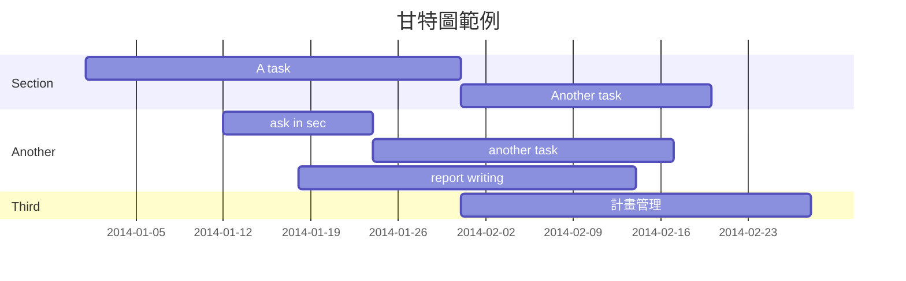
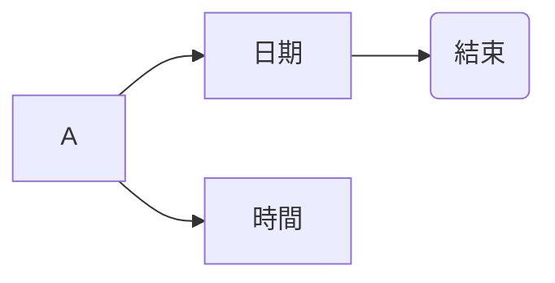

## 繪製甘特圖 Gantt Chart

```mermaid
gantt 
title  甘特圖範例 
dateFormat YYYY-MM-DD 
section Section 
A task :a1, 2014-01-01, 30d 
Another task :after a1 , 20d 
section Another 
ask in sec :2014-01-12 , 12d 
another task : 24d
report writing: 2014-01-18, 27d
section Third
計畫管理 :after a1,  28d
```

## 繪製  flow chart

```mermaid  
graph LR
A-->B[日期] & C[時間]

B-->D(結束)
```

[mermaid 教學](https://mermaid-js.github.io/mermaid/#/)