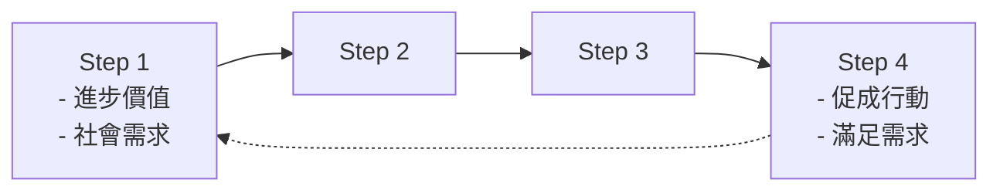

## 方法論初步討論
作為科技智庫應有的研究方法論述/ 科技政策議題論述之研究方法

### 重點摘要
- 方法應該為一個特定的說法，能夠適用於政策形成與決策的所有流程
- 中國科學院整理的資訊，應該為實現研究方法過程中的工具
- how to do
	1. 進步價值
	2. 趨勢
	3. 重點政策
	4. 可行性
	5. 民意 / 社會需求\
- target custerm 的影響
- 人才

### 一、目的：支援國家科技策略與政策決策之智庫角色
- 科技智庫角色：為國家決策者提供嚴謹、客觀、前瞻的研究報告與資訊
- 以期協助政策形成、政策決策並完善政策。
- 從發掘議題、界定問題與議題論述、(全球/國內)現況與未來趨勢、提供豐富完整資訊分析，協助決策者進行方案選擇與決策方向。並於政策執行過程提供完整資訊支援及政策評估，循環回饋未來政策議題形成與政策調整。
- 培育國家高階政策分析專家，整合資訊服務與學研界人才網絡，強化我國科技政策決策支援體系，提供國家政策幕僚服務及學研界研發所需之資料庫、前瞻科技產業發展趨勢、專利智財分析與研發成果商品化輔導，期能完善我國國家創新系統 (主任就職新聞稿)

### 二、 研究方法論
1. 研究途徑：政策實用主義(使用者需求/研究成果來影響和支援政府決策與公共政策)
2. 國家科技政策研究智庫原則/價值觀：嚴謹標準、客觀獨立、政策影響力 機制建立：[[方法論初步討論#^96c5a3|(1)]] 
	- 打造智庫專家合作網絡/跨領知識專家社群合作平台
	- 國內外資料庫建置與資源網絡串接：如大數據資料/資料採礦等，資訊數據加值利用與分析，找出前瞻科技趨勢，協助決策
	- 因應不同研究需求，建立與應用多元創新的研究方法
	- 內外部評審機制：研究報告公布前，進行內外專家審查，確保研究報告品質

3. 研究架構與流程：包含預測、預見和評估
**政策形成與決策**

![[pics/Pasted image 20210909090822.png]]

**科技智庫功能/目的**
- 透過智庫專家合作網絡與豐富資料庫資源，激盪發掘和界定議題問題，提供前瞻趨勢與分析
- 提出創新前瞻之科技政策論述與建議，評估可行性及協助政策形成
- 提供決策者嚴謹、客觀之專業研究報告與分析，協助決策方向
- 資訊溝通
- 科技政策及計畫執行過程提供資訊參考與評估
- 質詢或聽證提供完整關鍵資訊
- 推動創新前瞻的科技立法建議
- 為科技政策及計畫擬定先期、執行期中和事後提供評估建議，作為滾動式政策調整和未來政策建議之參考

4. 目前科技前瞻議題範疇：例如……

5. 研究方法與工具[[方法論初步討論#^c7be80|(2)]]
有無可能發展出我們自己的研究方法?

![[pics/Pasted image 20210909090930.png]]

**知識來源：兩軸線**
- 專業性(專家/特定領域的知識和技術)-互動性(產官學社會/納入非專家的利益相關人/強調參與和包容性)、
- 證據性(文件證據)-創造性(創新、靈感)

方法類型：質化-半量化-量化
時間構面、考量共識與分歧、行動方案產出(不同情境下，政策可能的影響；利益關係人)

![[pics/Pasted image 20210909091009.png]]

![[pics/Pasted image 20210909091017.png]]

![[pics/Pasted image 20210909091700.png]]
[http://www.bulletin.cas.cn/publish_article/2017/12/20171211.htm](http://www.bulletin.cas.cn/publish_article/2017/12/20171211.htm) 中國科學院

![[pics/Pasted image 20210909091715.png]]
蘭德公司還首創了許多獨特的研究方法和模型，包括德爾菲法（Delphi）、模型和預測（ Modeling and Forecasting）、博弈論（Gaming）、路線圖（ Roadmapping）等預測方法；系統分析法（ System Analysis Method）；組合分析工具（Portfolio Analysis Tool）、探索性建模（ Exploratory Modeling）、離散選擇模型（Discrete Choice Modelling）、健全性決策（ Robust Decision-making）、長期政策分析（Long-term Policy Analysis）等預測方法與模型；以及連續性品質改進方法（ Continuous Quality Improvement， CQI）（用於專案評價）、多方式調查能力系統（MultimodeInterviewing Capacity）（用於調查研究）、半結構化調查與焦點組方法（ Semi-structured Interviews and Focus Groups）（用於資料收集）、行動熱點方法（ Actionable HotSpot，AHS）（用於決策）、專家棱鏡系統（Expert Lens）（用於專家調查）、基於假設的規劃方法（Assumption-Based Planning）（幫助處理不確定性）等其他各種研究方法。

![[pics/Pasted image 20210909091728.png]]
![[pics/Pasted image 20210909091731.png]]

日本科技與技術政策研究所作為國際上有影響力的科技情報研究機構，在科技戰略情報研究中非常重視規範研究方法的應用。其使用的研究方法主要有：文獻計量學與科學計量學方法、專利分析、統計分析法、路線圖、定標比超、案例分析、政策分析方法、調查法、德爾菲法、專家組方法、情景分析法，以及投資分析、成本-收益分析、投入產出分析等。 NISTEP的研究工作，有很大比例是其所開展的調查研究工作，在該過程中採用了各種形式的調查方法。 NISTEP非常突出的工作是其開展的技術預見研究，在技術預見過程中就主要採用了調查法、德爾菲法和情景分析法等多種調查研究方法。

  

---

1. 日本科技前瞻政策的形成，有兩大塊：技術預見(專家討論、公民社會討論，來形成共識與論]述)，科學地圖(宏觀數據分析，找出科技前沿) ^96c5a3

2. Popper, R. (2008)_ _Foresight Methodology__, in Georghiou, L., Cassingena, J., Keenan, M., Miles, I. and Popper, R.,_ [_The Handbook of Technology Foresight: Concepts and Practice_](https://www.e-elgar.com/shop/gbp/the-handbook-of-technology-foresight-9781848448100.htm- "Foresight Handbook")_, Edward Elgar, Cheltenham, pp. 44-88._ [https://rafaelpopper.wordpress.com/foresight-diamond/](https://rafaelpopper.wordpress.com/foresight-diamond/) ^c7be80
